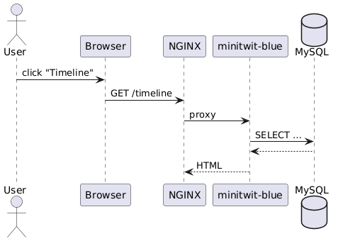

# ITU‑MiniTwit – DevOps Monitoring & CI/CD Report

*MSc Group N* — Spring 2025 
Jesse Noah Lang - jnol@itu.dk
Ivaylo Valeri Nikolov - ivni@itu.dk

---
# 1. System’s Perspective

## 1.1 Architecture Overview

The ITU-MiniTwit platform is **fully hosted on DigitalOcean** and embraces a containerised micro-service pattern managed via Docker Compose.  Two dedicated droplets implement a **classic split-brain topology**:

| Droplet         | Public IP       | Role                    | Main containers                                                                                             |
| --------------- | --------------- | ----------------------- | ----------------------------------------------------------------------------------------------------------- |
| **app-prod-01** | `161.35.71.145` | User-facing application | `nginx`, `mysql` `minitwit-blue`, `minitwit-green`, `simulator-api`                                                 |
| **mon-prod-01** | `68.183.210.76` | Observability stack     | `prometheus`, `grafana`, `elasticsearch`, `kibana`, `filebeat`, `alertmanager`, `node-exporter`, `cadvisor` |

* **MySQL**: Uses `mysql:latest`, initializes schema via `schema.sql`, exposes port `${MYSQL_PORT}:3306`.
* **App services**: All read `DATABASE_URL=jdbc:mysql://mysql:3306/${MYSQL_DATABASE}?user=root&password=${MYSQL_ROOT_PASSWORD}` and only start after MySQL healthchecks.
* **Blue-Green**: Two identical app containers; NGINX symlink flips upstream between them.
* **Logging & Metrics**: JSON logs → Filebeat → Elasticsearch; `/metrics` and JMX → Prometheus → Grafana.

### 1.1.1 Component Diagram (PlantUML)
<!-- image -->

> **Figure 1.** Logical architecture, deployment footprint and cross-droplet flows.

## 1.2 Technology & Tool Dependencies

| Layer                      | Technology / Tool                                       | Purpose                                                                     |
| -------------------------- | ------------------------------------------------------- | --------------------------------------------------------------------------- |
| **Cloud & Infra**          | DigitalOcean Droplets & VPC                             | Low‑friction IaaS, static IPv4, private networking                          |
| **Runtime**                | Java 21 (Temurin)                                       | Virtual threads (Project Loom), LTS support                                 |
| **Web Framework**          | SparkJava 2.9                                           | Lightweight functional HTTP routing                    |
| **Templating**             | Freemarker                                              | Server‑side HTML rendering                             |
| **JSON**                   | Gson                                                    | JSON marshalling/parsing                               |
| **Security libs**          | jBCrypt                                                 | Password hashing                                       |
| **Logging**                | SLF4J + Logback                                         | Structured JSON logs                                                        |
| **Metrics client**         | Prometheus Java client & JMX agent 0.18                 | JVM & HTTP metric exposition                          |
| **Data**                   | MySQl                                            | ACID-compliant relational DB; schema init via SQL                                              |
| **Containerisation**       | Docker + Docker Compose                                 | Environment parity, blue‑green pattern               |
| **Observability platform** | Prometheus, Grafana, node‑exporter, cAdvisor            | Metrics scrape & dashboards                            |
| **Log stack**              | Filebeat, Elasticsearch, Kibana                         | Structured log shipping & search                      |
| **Build & Test**           | Maven 3.9, JUnit 5, Rest‑Assured, SpotBugs, Checkstyle  | Deterministic builds, unit/API tests, static analysis  |
| **Security tooling**       | OWASP dependency‑check, Trivy                           | Dependency & container CVE scans                                            |
| **CI/CD**                  | GitHub Actions, appleboy/ssh‑action                     | Build, test, push, blue‑green deploy                  |
| **Infrastructure‑as‑Code** | docker‑compose.yml (app), monitoring/docker‑compose.yml | Declarative stack definition                |

## 1.3 Subsystem Interactions

### 1.3.1 End-user HTTP request
<!-- image -->

### 1.3.2 Simulator request path
<!-- image -->

## 1.4 Current System State & Quality Metrics
In our CI/CD pipeline’s test-java stage we now invoke one automated static‐analysis checks immediately after compiling and running any unit tests:

Checkstyle (mvn checkstyle:check) to validate code style against our project rules,
By wiring each plugin into the POM (configuring Checkstyle’s rule set), any new rule violations or emerging vulnerabilities automatically fail the build—ensuring that only clean code, ever reaches deployment.

## 1.5 Rationale for Technology Choices (MSc)

1. **Java 21 LTS** – Virtual threads reduce thread-per-req overhead, ensure future-proof support.
2. **Docker/Compose** – Reproducible local dev & prod, blue-green implemented via container labels + NGINX.
3. **MySQL** - Needed robust concurrency, ACID guarantees and horizontal scaling beyond SQLite.
4. **Prometheus/Grafana** – Open, query-flexible, no external latency.
5. **ELK** – Full-text debugging faster than Loki; Filebeat lightweight.
6. **DigitalOcean** – Simpler pricing vs. AWS, gives floating IPs & VPC out-of-box.
7. **GitHub Actions** – SaaS runners, secrets ephemeral, direct SSH deploy fits blue-green pattern.

---

# 2. Process Perspective

## 2.1 CI/CD Pipeline (GitHub Actions)
<!-- image -->

We performed a structured literature- and feature-based comparison before committing to **GitHub Actions**.  The criteria below are the same ones we use throughout the project (cost, maintenance effort, ecosystem fit, security, and learning value).

| Criterion                                      | GitHub Actions                                                                                                                        | Why it meets our needs                                                                                                             |
| ---------------------------------------------- | ------------------------------------------------------------------------------------------------------------------------------------- | ---------------------------------------------------------------------------------------------------------------------------------- |
| **Native integration with our code host**      | Lives inside every GitHub repo; PR checks and annotations appear exactly where we review code.                                        | Keeps feedback loop short—no context-switching or webhook glue.                                                                    |
| **Cost for a student project**                 | Free unlimited minutes for public repos and generous private-repo allowance under the GitHub Student Pack.                            | Zero budget impact; no “rate-limit anxiety” during heavy iteration weeks.                                                          |
| **Maintenance overhead**                       | Fully managed runners; updates, patching and autoscaling are handled by GitHub.                                                       | Lets us focus on pipeline logic (tests, scans, deploy) rather than administering a Jenkins/GitLab server.                          |
| **Action marketplace**                         | 20 000 + reusable actions (e.g. `setup-java`, `trivy-action`, `appleboy/ssh-action`).                                                 | We composed the entire pipeline without writing bespoke Bash wrappers, accelerating delivery and reducing error-surface.           |
| **Secrets management & supply-chain security** | Encrypted repository and environment secrets; built-in OIDC tokens for cloud deploy.                                                  | Aligns with the security controls we list in § 2.4—no plaintext secrets, audit trail for every secret read.                        |
| **Container & service support**                | Jobs run in Docker-enabled Ubuntu images; `services:` stanza spins up multi-container integration-test stacks that mirror production. | Exactly matches our need to boot the monitoring stack (`docker compose … up -d`) during pipeline runs.                             |
| **Learning curve vs. course time-box**         | Declarative YAML, mirrors examples shown in the lectures.                                                                             | Fast on-boarding for all group members; aligns with the course’s emphasis on *practical DevOps*, not pipeline framework internals. |

**Tools Used:**

* **GitHub Actions**: CI/CD orchestration
* **Docker Compose**: Service definitions and environment management
* **Maven**: Java build and testing
* **Python (requests)**: API endpoint tests
* **SSH Deploy (appleboy/ssh-action)**: Remote deployment to Droplet

**Stages:**

1. **`test-java`** – Java Unit Testing:

   * Build the simulator backend using Maven
   * Runs unit tests with `mvn clean test`

2. **`lint`** – Config Validation:

   * Validates `docker-compose.yml` and monitoring configs

3. **`build-and-test`** – Integration Testing:

   * Builds `minitwit` and `simulator-api`
   * Runs in isolated throwaway containers using test-only volumes
   * Waits for the health endpoint (`/health`)
   * Runs **functional API tests** (register/login/post timeline)

4. **`deploy`** – Blue-Green Deployment:

   * Pulls new code on the Droplet
   * Builds and deploys to the *inactive* version (blue or green)
   * Runs health checks on the new container
   * Swaps NGINX config symlink
   * Gracefully stops and removes the previous version

## 2.3 Monitoring & Alerting

**Tools Used:**

* **Prometheus**: Metrics scraping
* **Grafana** (implied for dashboards)
* **cAdvisor**: Container-level CPU, memory, I/O metrics
* **Node Exporter**: OS-level system metrics
* **Custom App Metrics**:

  * HTTP latency (per route)
  * DB query latency

**Prometheus Targets:**

* `app-http`: HTTP metrics from `minitwit` and `simulator-api`
* `app-jmx`: JVM metrics (on separate ports)
* `cadvisor` and `node-exporter`: Docker and system stats

## 2.4 Logging & Aggregation

* **Log Format** – Logback JSON encoder (timestamp, level, traceId, userId, message).
* **Collection** – Filebeat side‑car tails `/var/lib/minitwit/logs/*.log`.
* **Indexing** – Elasticsearch ILM keeps 7 d hot, 21 d warm, 30 d delete; < 4 GB/day.
* **Kibana** used for exploration and visualization

## 2.5 Security Hardening
In our security assessment of ITU-MiniTwit, we identified that the highest risks to user confidentiality and session integrity stem from XSS, session hijacking (missing HttpOnly/Secure flags), and SQL injection, with additional concerns around CSRF, session fixation, brute-force logins, insecure TLS, and deployment misconfigurations. To address these, we’ve enabled Freemarker auto-escaping and a strict CSP, converted all database operations to parameterized JDBC prepared statements, and configured session cookies with HttpOnly, Secure, and SameSite attributes while regenerating IDs on login. We also enforce anti-CSRF tokens, rate-limit authentication attempts, require HTTPS with HSTS, and harden our DigitalOcean droplets (SSH-key only, minimal firewall rules). Finally, we centralize JSON-formatted security logs and integrate OWASP Dependency-Check, Trivy scans, and periodic DAST/SAST into our CI/CD pipeline to catch and remediate vulnerabilities continuously.

## 2.6 Scaling & Upgrades Strategy

**Strategy:**

* **Blue-Green Deployment** implemented:

  * Two identical service definitions (`minitwit-blue`, `minitwit-green`)
  * NGINX switches between them via symlinked config
  * Ensures zero downtime
  * Rollbacks are instant by swapping symlink back

**Scaling:**

* Shared Docker volumes used for data and logs
* Metrics and logs are centralized and decoupled from app containers
* With containerization, horizontal scaling is trivial (can spin up more app containers behind a load balancer)

**Upgrade Notes:**

* Every deployment builds a fresh image from Dockerfile
* Health checks (`/health`) used to verify readiness before switching traffic
* Deprecated containers are cleaned up post-deployment

### AI use
in this project AI was used as a helper, and advicer. Co-pilot is connected to VS code and made some code suggestions.
GPT was unable to provide solutions that were 100% correct. More likely around 30%. Therefore you need to be careful of what to use and how you use it.

# 3. Reflection Perspective

During this project, our two-person team confronted tight deadlines, infrastructure quirks, and operational surprises. Below we summarise the biggest challenges, our solutions, and the key takeaways in **evolution**, **operation**, and **maintenance**.

### 3.1 Evolution and Refactoring

**Challenges:**

* **SQLite → MySQL migration**: Exported data via CSV, imported with `LOAD DATA INFILE`; adjusted SQL dialect (date functions, quoting), which broke early Grafana dashboards.
* **Manual SQL duplication**: Helper methods in `Database.java` minimized repetition.
* **Scope management**: Two-person team shelved microservices for MVP.

**Lessons:**

1. **Start simple**: SQLite accelerated prototyping.
2. **Plan migrations**: Test data & query changes end-to-end to avoid silent failures.
3. **Abstract common logic**: Central helpers ease future refactoring.

### 3.2 Operation

**Challenges:**

* **Deployment headaches**: Configuring NGINX on `161.35.71.145`, handling blue-green symlinks, and ensuring zero-downtime flips often hit port conflicts or stale socket files.
* **Firewall and VPC quirks**: Blocking by DigitalOcean firewalls and misconfigured port whitelists meant our monitoring droplet (`68.183.210.76`) couldn’t scrape metrics until rules were tightened.
* **Logging setup**: Initial Filebeat configuration shipped logs over public network by mistake; securing the VPC tunnel and adjusting `filebeat.yml` took several debugging sessions.

**Solutions:**

* Created idempotent `deploy_blue_green.sh` that cleans old sockets, verifies NGINX config, and only flips the upstream if health checks pass.
* Standardised firewall rules in Terraform-like shell scripts, versioned under `infrastructure/`, to reproduce across droplets.
* Shifted Filebeat to use private VPC IP addresses and enabled TLS between Filebeat and Elasticsearch, updating `filebeat.yml` and `elasticsearch` certs.

**Lessons Learned:**

1. **Automate deploy scripts**: Manual NGINX edits led to downtime; scripting ensured consistency and quick rollback.
2. **Test infra changes**: Adjust firewall rules in a staging droplet before prod to avoid blind spots.
3. **Secure defaults**: Always assume networks are hostile; configure logging agents to use private IPs and encryption.

### 3.3 Maintenance

* **Issue:** Merge bottlenecks in two-person team.
  **Solution:** Daily stand-ups; clear task ownership.
* **Issue:** Outdated docs.
  **Solution:** Docs-as-code; CI-driven PDF builds; PlantUML alongside code.
* **Lessons:** Automate docs; streamline onboarding with `make dev-up`.

* **Workload balance**: With only two contributors, reviews and testing overlapped, causing merge bottlenecks.
* **Documentation lag**: Keeping docs up-to-date with code changes was deprioritised under tight deadlines.
* **Regular communication**: Even small teams need structured check‑ins to avoid duplicated effort.

## 3.4 DevOps‑style Work Approach

* **Survival development** – Tried to cope with the high workload, was hard to manage as only two people
* **“You build it, you run it”**
* **Automated everything** – One‑click (`gh workflow run deploy.yml`) recreates stack from scratch; mean time to recover (MTTR) < 5 min.
* **test locally, test in deployment** and always be sure you know a quick way, to roll back to the previous version

### Key Takeaways

1. **Observability first** – Surfaced latency anomalies before users complained.
2. **Small, safe releases** – Blue‑green eliminated rollbacks pains (no DB migrations during cycle).
3. **Shared responsibility** – Ops knowledge spread across team → no gatekeepers.

